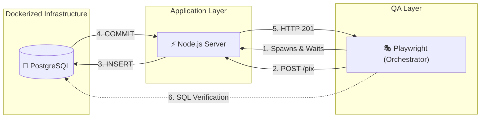

# 🏦 Vertex Financial - Full-Stack QA Engineering Architecture


## 🎯 Context & Objective

**Vertex Financial** is a fictional fintech environment designed as a **technical proof-of-concept**. 

The goal of this project is not to build a commercial banking app, but to showcase a **QA Architecture** capable of validating financial transactions by controlling the entire stack.

## 💡 The Engineering Vision

Instead of automating a UI against a black box, I built the entire stack (Database, API, and Tests) to demonstrate how a QA Engineer can orchestrate the environment to guarantee data consistency and infrastructure ownership.

## 🛠️ Technical Highlights

### 1. Infrastructure (Docker & Compose)
- **Problem:** Dependency on third parties to provision test databases.
- **Solution:** I created a `docker-compose` architecture that orchestrates a sterile PostgreSQL instance on demand. This ensures every test run starts with a known state, eliminating false positives caused by "dirty data".

### 2. Backend Engineering (Node.js API)
- **Problem:** QA often lacks visibility into backend logic.
- **Solution:** I built a custom REST API (`server.ts`) from scratch using **Express** and **TypeScript**. This demonstrates the ability to read, debug, and contribute to backend code, moving beyond simple black-box testing.

### 3. Data Integrity Validation (The "DbHelper")
- **Problem:** API tests often trust the HTTP 200 OK response without verifying persistence.
- **Solution:** Implemented a **Database Abstraction Layer** using `pg` to perform direct SQL assertions. The tests validate that the transaction was chemically persisted in PostgreSQL, preventing "false success" scenarios.

### 4. CI/CD Pipeline Strategy
- **Problem:** "It works on my machine."
- **Solution:** Configured GitHub Actions to replicate the local Docker infrastructure in the cloud. The pipeline spins up the database service, waits for health checks, and executes the suite in a pristine containerized environment.

---

## 🏗️ Architecture & Orchestration

The system implements a **Framework-Driven Architecture**. 

Unlike traditional setups where the CI pipeline manages processes loosely, here **Playwright acts as the Orchestrator**. via the `webServer` configuration, it manages the entire lifecycle:
1.  **Spawns** the Node.js API process before tests begin.
2.  **Waits** for the HTTP Health Check (`/`) to return 200 OK.
3.  **Executes** the E2E suite against the fresh instance.
4.  **Teardowns** the API process gracefully after execution.


## 📂 Project Structure

The project follows a modular architecture designed for maintainability:

```text
├── tests/              # Playwright Specifications (E2E)
│   └── pix-api.spec.ts # Transaction & Balance Tests
├── utils/
│   └── db-helper.ts    # Database Abstraction Layer (DAL)
├── server.ts           # Node.js Express API (System Under Test)
├── docker-compose.yml  # Infrastructure as Code
└── tsconfig.json       # TypeScript Configuration
```

### ▶️ How to Run 

### 1. Prerequisites
* Node.js (v20+)
* Docker & Docker Compose

### 2. Setup
```bash
# Install dependencies and the required browser binary
npm install
npx playwright install chromium
```
### 3. Start Database
Spin up the sterile PostgreSQL container. The schema is applied automatically.
```bash
docker-compose up -d
```
### 4. Run Tests (One-Step Execution)
You do not need to start the backend manually. Playwright will automatically spin up the `server.ts` API, wait for port 3000 to be ready, run the tests, and close the server.
```bash
npx playwright test
```


<p align="center"> Built with 💙 by a QA Engineer passionate about automation framework design. </p>